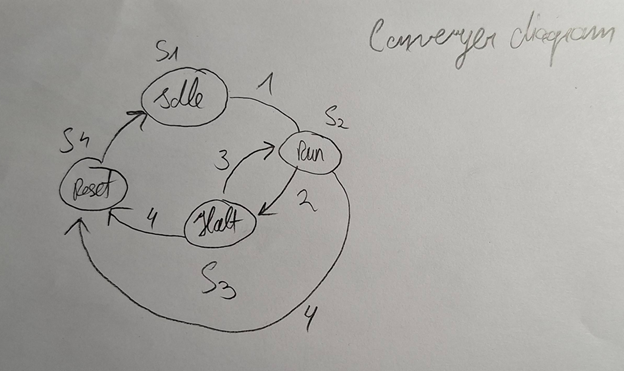
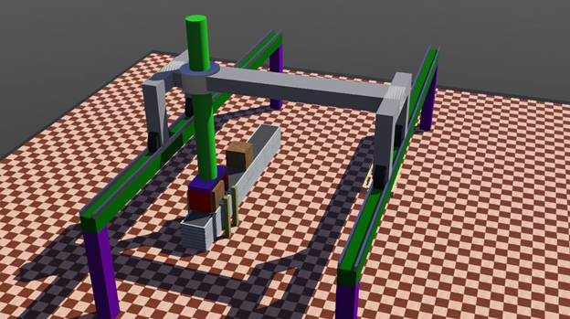

## Introduction

This was a project for uni course.

Basic idea is that a crane picks up boxes and delivers them to designated location.

Conveyor has sensors that detect if box is present, sends a signal to the PLC that a box is ready for pickup and PLC activates the crane controller.

Communication between simulation and TwinCAT PLC is via modbus tcp.

Conveyor and crane controllers were shoddily written in C, and then rewritten to python because of easier modbus support.

It's janky and bad, but I made it and I guess that makes it better :^)

## Manufacturing system

### Diagrams

The conveyor is controlled internally by a STM32 microcontroller which interfaces with PLC,

It controls the state of conveyor and speed via M1 output to the motor VFD and then outputs its current state to the PLC.

The microcontroller also interfaces with light sensors S1 and S2, for box detection. If box is detected it sends a signal to the PLC.

Crane robot is controlled internally by a STM32 microcontroller as well.

MW1-4 are either asynchronous motors controlled by VFDS, or brushless DC motors for better precision control.

MB1 is a bridge motor that controls bridge movement along horizontal axis. It’s an asynchronous motor that’s connected to a belt.

MC1 is a crane reel motor, it controls crane’s up and down movement. Asynchronous motor.

MG1-2 are gripper motors, these are stepper motors for maximum precision.

For asynchronous motors for their reversal operation it’s necessary to use NC/NO relays, or use VFDs.

Microcontroller also interfaces with PLC, it sends the state of the crane robot (Crane controller active, crane moving, crane idle), waits for a signal from PLC to start picking up crates.

## Solution

### Conveyer robot state diagram

S1 – Idle state - conveyor STM is waiting for PLC command to start operation

S2 – Run state – Belt is active and rolling

S3 – Halt state – Box is detected in the box pickup area; belt is stopped and waiting for crane to pick up the box.

S4 – Reset state – Resets to idle state.

1 = Make the conveyor belt move.

2 = Sensors detected that a box is present pick up area is occupied.

3 = Crate was picked up, sensors detected that pick up area is clear.

4 = Full reset signal from PLC, stops all operation.

### Crane robot state diagram

S1 – Idle state, crane STM is awaiting instructions from PLC to start operation.

S2 – Ready state, crane is waiting for box to arrive to the pick up area.

S3 – Box state, box is detected and crane receiver the signal from PLC to start moving towards the pick up area.

S4 – No box state, crane receives the signal from PLC that there is no box ready for pick up and goes back to Ready state.

S5 – Place state, crane goes to the unloading area to drop the box.

S6 – Return state, crane returns to it’s original position.

S7 – Reset state, resets the robot to Idle state.

Main loop is S2 – S3 – S5 – S6 with possible branching, if there’s a box present on pick up area while the crane is still placing current box or returning to it’s original position it will immediately go to the box pick up area to pick another box up.

If there’s no box present it will idle in it’s ready state.

### Block diagram

## Visualization

### Webots simulation

First state, robot awaiting instructions from PLC.

Robot is moving to pick up the box.

Robot is delivering crate to the drop location, another crate waiting for pick up.

Finished state, crates were delivered to the designated location and robot is idle.

For simulation to work properly it is necessary to have pymodbus == 2.5.3 library installed, for modbus communication.

## PLC Variables

PROGRAM MAIN

VAR

resetButton : BOOL;

buttonPressed : BOOL;

LAMP : BOOL; //Box is present in the pick up area

craneMoving : BOOL;

craneControllerStarted : BOOL;

craneIdle : BOOL;

beltMoving : BOOL;

beltStopped : BOOL;

END_VAR

Global variables for Modbus communication.

VAR_GLOBAL

mb_Input_Coils : ARRAY \[0..255\] OF BOOL;

mb_Output_Coils : ARRAY \[0..255\] OF BOOL;

mb_Input_Registers : ARRAY \[0..255\] OF WORD;

mb_Output_Registers : ARRAY \[0..255\] OF WORD;

END_VAR

## PLC Program export

IF (buttonPressed = TRUE) THEN // Start the belt which kicks off everything

GVL.mb_Input_Registers\[0\] := 1;

beltMoving := TRUE; // Indicator

END_IF

//Box detection logic, box detected - send the signal to the crane to start moving

IF (GVL.mb_Output_Registers\[0\] = 1) THEN // Box detected

GVL.mb_Input_Registers\[1\] := 1; //Box detected, write to webots to start crane controller

beltStopped := TRUE; //Indicator

beltMoving := FALSE; //Indicator

LAMP := TRUE; // Box waiting for pickup, indicator

craneControllerStarted := TRUE; // Indicator

END_IF

//Box detection logic, box is not present

IF (GVL.mb_Output_Registers\[0\] = 0) THEN // No box detected

GVL.mb_Input_Registers\[1\] := 0; // No box idle crane

IF (GVL.mb_Input_Registers\[0\] = 1) THEN

beltMoving := TRUE; // Indicator

beltStopped := FALSE; // Indicator

END_IF

LAMP := FALSE; // No box waiting, Indicator

END_IF

//Checking if the crane is moving

IF (GVL.mb_Output_Registers\[1\] = 1) THEN

craneMoving := TRUE; // Indicator

IF (craneControllerStarted = TRUE) THEN

craneIdle := FALSE; // Indicator

END_IF

END_IF

//Checking if the crane is idle

IF (GVL.mb_Output_Registers\[1\] = 0) THEN

craneMoving := FALSE; // Indicator

IF (craneControllerStarted = TRUE) THEN

craneIdle := TRUE; // Indicator

END_IF

END_IF

//Reset button

IF (resetButton = TRUE) THEN

GVL.mb_Input_Registers\[0\] := 0; // Belt start

GVL.mb_Input_Registers\[1\] := 0; // Box detection to webots

GVL.mb_Output_Registers\[0\] := 0; // Box detection signal from webots

GVL.mb_Output_Registers\[1\] := 0; // Crane detection moving/idle

LAMP := FALSE; // Indicator

craneMoving := FALSE; // Indicator

craneControllerStarted := FALSE; // Indicator

craneIdle := FALSE; // Indicator

beltMoving := FALSE; // Indicator

beltStopped := FALSE; // Indicator

END_IF

I only used Input and Output registers, but it would be possible to just use coils for this kind of logic, but I started with Registers and stuck with them using them either as 1 or 0 representing true or false.

## PLC HMI

Human – machine interface consists of two buttons and six indicator lamps.

Buttons are labeled Start and Reset.

Start button “starts” the whole process by activating conveyor belt, and the Reset button “resets” it to the idle state by clearing all the values on the PLC.

The indicators are for various states of operation – belt and crane movement, box detection indicator if the box is present in the pickup area, and if the crane controller is active and ready for box pick up.

## Final state screenshots

Final state of HMI visualition.  

 
Final state of simulation.

## Discussion

This project consists of two inbuilt robots that were modified by me. One being the conveyor belt robot that I added light detection sensors, and the other being the crane robot that I redesigned to fit my project needs, namely the size and shape.

For both robots I wrote new controllers to interface with TwinCAT3 and there’s also backup version of controllers that work independently on their own without any PLC communication.

There’s a lot of added delay for robot movement in the code, it’s possible to optimize the delay by tweaking the values or by adding additional sensors to the crane robot. The sensor route is more sensical but greatly expands the complexity of this project.

The main issue with this robot is that it places all the boxes to the same place – on the same pallet, resulting in squishing the subsequent boxes one into each other. That may be rectified by rewriting the controller/PLC code, so it accounts for which place is occupied, and which is free. But unfortunately, that’s beyond my programming skills, so it was skipped.

It’s also possible to add distance sensors to the gripper part of the crane, that way it would be possible to pick up a box of any size.
